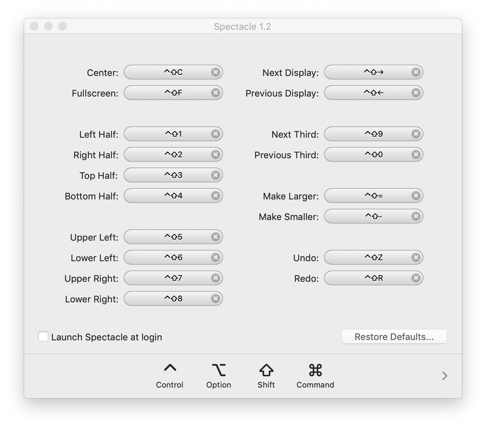
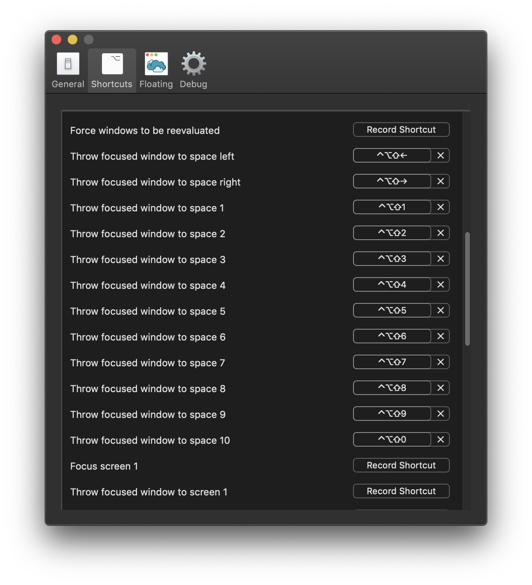

# Mac Window Tiling

I use a combination of Spectacle and Amethyst (Amethyst is purely for the ability to move spaces)


## Spectacle

```bash
brew cask install spectacle
```

* Update all major combinations to work with Shift + Control + 1-9
* Remove the key combinations for the other sizes
* System Preferences -> Security and Privacy -> Accessibility -> Check



## Amethyst

```bash
brew cask install amethyst
```

* Keep it disabled but the shortcuts will work
* Remove all shortcuts except for ones related to spaces



### Amethyst Bug

What: Actions `Throw focused window to space left` and `Throw focused window to space right` do not work   
When: There is a full screen window to the left of the space the window is in.
Notes: Dashboard as Space counts.